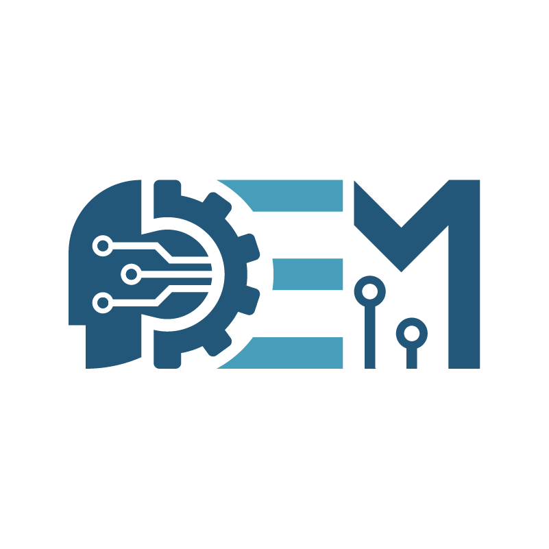

# DEM App

**Contenido**
- [Descripción](#id1)  
- [Contribuir](#id2)  
- [Pasos para contribuir](#id3)  
- [Issues](#id4)  

## Descripción<a name='id1'><a>  
Este proyecto pretende el desarrollo de una PWA (Progressive Web App), para lograr este objetivo se desarrolla partiendo de un sitio web.  
Las tecnologías principales para este proyecto son JavaScript, HTML y CSS.  
El proyecto fue iniciado y es mantenido por el equipo de la División Estudiantil de Mecatrónica (DEM) conformada por estudiantes de la Universidad Autónoma de Yucatán.  

  

## Contribuir<a name='id2'><a>   
Si cuentas con conocimiento para el desarrollo de esta aplicación, no dudes en contribuir y si no tienes mucho conocimiento para el desarrollo, pero te gustaría contribuir, no dudes en formar parte de este proyecto.  
Tu contribución puede ser escribiendo código o ayudando en la documentación y otras actividades relacionadas.  

### Pasos para contribuir<a name='id3'><a>  
- Desde tu cuenta de GitHub haz un Fork de este repositorio.  
- Clona el repositorio desde tu perfil de GitHub.  
- Crea una rama en el repositorio y desde esta rama realiza tus aportaciones.
- Una vez que estes satisfecho con tu aportación, modifica el archivo [contribuidores.md](Contribuidores.md) y agrega tu nombre, **NO BORRES NINGUN NOMBRE**.
- Realiza un commit.
- Desde tu cuenta de GitHub, realiza un pull request y describe la aportación realizada.
- Tu contribución será revisada para poder ser aceptada.  

Para guiarte en este proceso, revisa un artículo al respecto dando [click aquí](https://kbroman.org/github_tutorial/pages/fork.html).

## Issues<a name='id4'><a>  
Si tienes alguna sugerencia para este proyecto, usa la sección de issues para realizarla, la sugerencia o comentario será atendido por alguno de los contribuidores de este proyecto.
